# Hyyve Platform - Architecture Synthesis

**Date:** 2026-01-23
**Status:** Complete (v1.5 - Comprehensive Validation Complete)
**Source Documents:** 34 research documents (Tiers 0-8 including validation reports) + 6 planning artifacts = 40 total

---

## Executive Summary

This document synthesizes all 30 research documents into a unified system architecture. It eliminates redundancies, validates component relationships, and provides comprehensive Mermaid diagrams showing how all parts work together.

---

## 1. Platform Overview

### 1.1 Core Platform Hierarchy

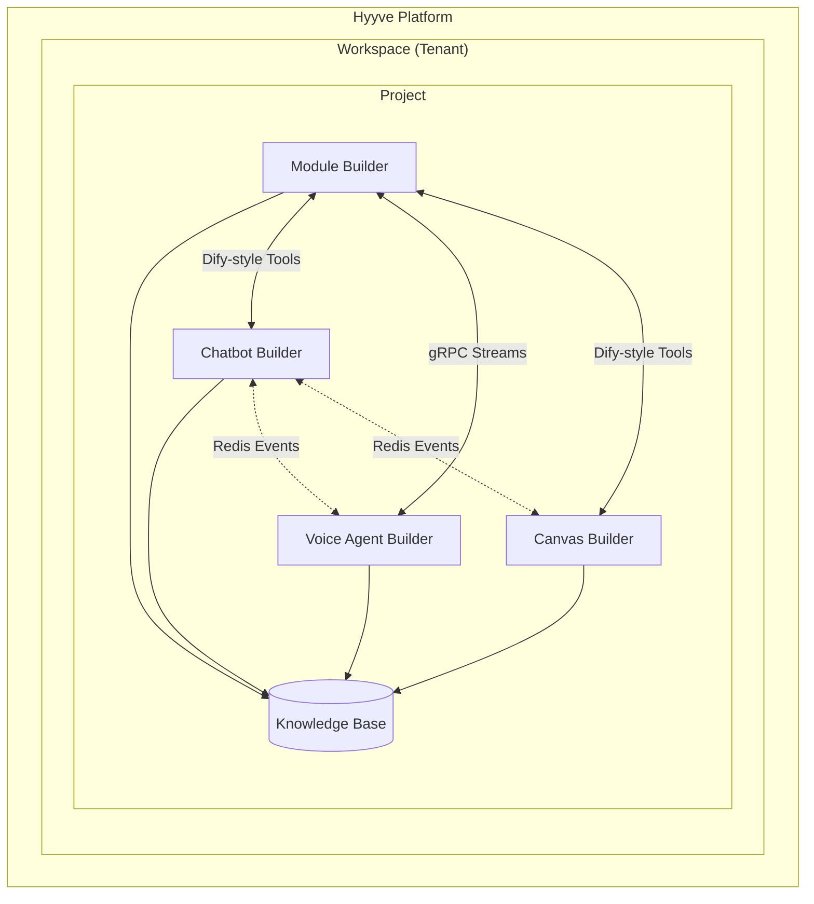

> **Key Insight:** Internal integration uses lightweight patterns (Dify-style tools, Redis Pub/Sub, PostgreSQL NOTIFY) instead of MCP. MCP is reserved for LLM function calling and external tool integrations.

### 1.2 Four Build Types

| Build Type | Purpose | Output | Primary Users |
|------------|---------|--------|---------------|
| **Module** | Backend intelligence | Agents, Workflows, Tasks | Developers, Agencies |
| **Chatbot** | Customer-facing text | Conversation flows | Business Users |
| **Voice Agent** | Customer-facing voice | Voice pipelines | Call Centers |
| **Canvas** | Visual content | Images, Videos, Assets | Marketers, Designers |

---

## 2. Unified Technology Stack

### 2.1 Frontend Layer

| Component | Technology | Source Document |
|-----------|------------|-----------------|
| **Visual Builders** | ReactFlow + Zustand | Tier 1: Visual Workflow |
| **UI Components** | shadcn/ui + Radix | Tier 3: UI Generation |
| **Real-time Collab** | Yjs + Y-Sweet | Tier 4: Collaborative Editing |
| **State Management** | Zustand + Immer | Tier 1, 6, 7 |
| **Chat Interface** | CopilotKit (A2UI) | Tier 0: Protocols |
| **Canvas** | ReactFlow infinite | Tier 7: Canvas Builder |

### 2.2 Backend Layer

| Component | Technology | Source Document |
|-----------|------------|-----------------|
| **API Framework** | FastAPI (Python) / Next.js (Node) | Tier 1: Claude SDK |
| **Agent Framework** | Claude Agent SDK + Agno | Tier 0-1: RAG SDK, Claude SDK |
| **Workflow Engine** | Custom DAG executor | Tier 1: Visual Workflow, Tier 7: Canvas |
| **Message Queue** | Redis Streams / NATS | Tier 6: Integration Layer |
| **Task Orchestration** | Temporal | Tier 4: Command Center |
| **Code Execution** | Firecracker MicroVMs | Tier 4: Security Sandboxing |

### 2.3 Data Layer

| Component | Technology | Source Document |
|-----------|------------|-----------------|
| **Primary Database** | Supabase (PostgreSQL + RLS) | Tier 1: Multi-tenant SaaS |
| **Enterprise Isolation** | Neon (per-tenant DB) | Tier 1: Multi-tenant SaaS |
| **Vector Database** | pgvector (Supabase) | Tier 0: RAG SDK |
| **Graph Database** | Graphiti / Neo4j | Tier 0: RAG SDK |
| **Cache** | Redis | All Tiers |
| **Object Storage** | S3-compatible | Tier 7: Canvas Builder |
| **Time Series** | TimescaleDB | Tier 3: Billing Metering |

### 2.4 External Services

| Service | Provider | Purpose | Source Document |
|---------|----------|---------|-----------------|
| **Auth (Consumer)** | Clerk | SSO, Organizations | Tier 1, 5 |
| **Auth (Enterprise)** | WorkOS | SAML, SCIM | Tier 5: SSO Enterprise |
| **Payments** | Stripe + Connect | Billing, Marketplace | Tier 2-3: Marketplace, Billing |
| **Observability** | Langfuse (self-hosted) | Tracing, Cost | Tier 4: Observability |
| **Email** | Resend | Transactional | Tier 5: White Label |
| **Telephony** | Twilio | Voice, SIP | Tier 6: Voice Stack |
| **Customer Support** | Chatwoot | Multi-channel | Tier 4: Chatwoot |

### 2.5 AI Providers (via fal.ai Gateway)

| Category | Primary | Fallback | Source |
|----------|---------|----------|--------|
| **Images** | Flux 2 Pro | Ideogram 3 | Tier 8 |
| **Videos** | Kling 2.6 | Minimax Hailuo | Tier 8 |
| **TTS** | ElevenLabs V3 | Cartesia | Tier 6, 8 |
| **STT** | Deepgram | Whisper | Tier 6 |
| **3D** | Meshy 6 | Tripo v2.5 | Tier 8 |
| **LLM** | Claude (Anthropic) | GPT-4o (OpenAI) | Tier 0-1 |

---

## 3. System Architecture Diagrams

### 3.1 High-Level System Architecture

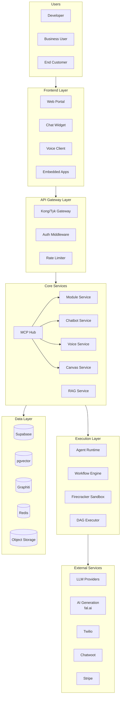

### 3.2 Multi-Tenant Data Architecture

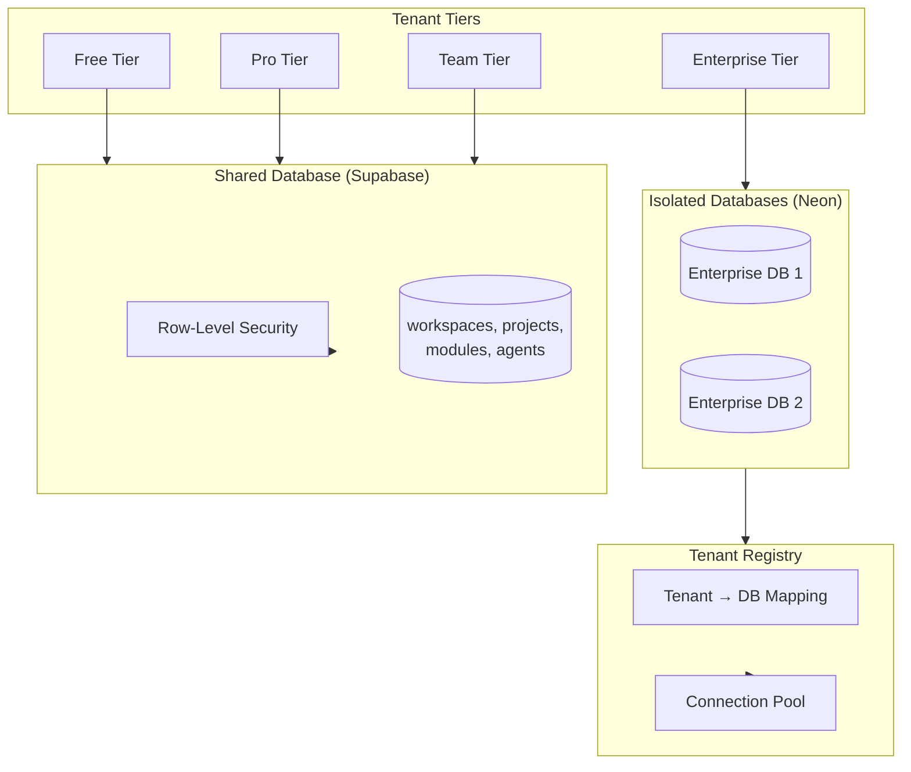

### 3.3 Protocol Stack Architecture

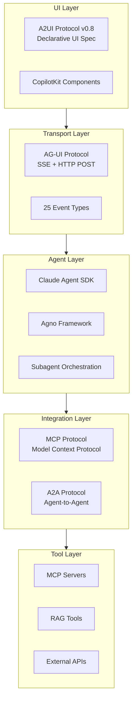

### 3.4 Module Builder Architecture

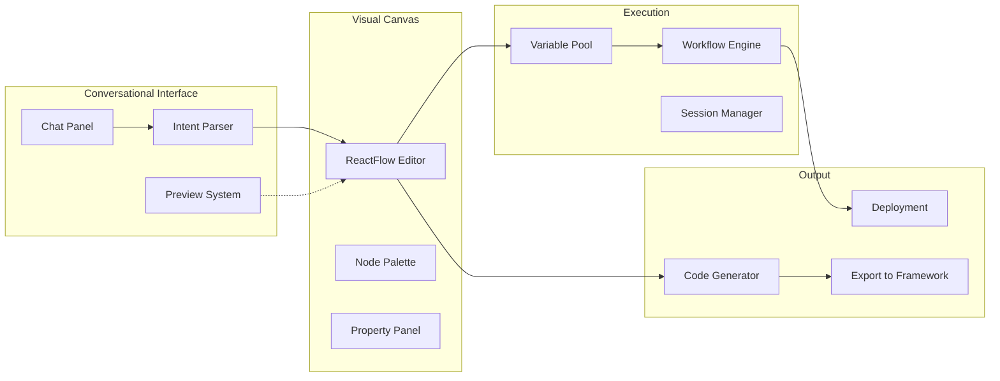

### 3.5 Chatbot Builder Architecture

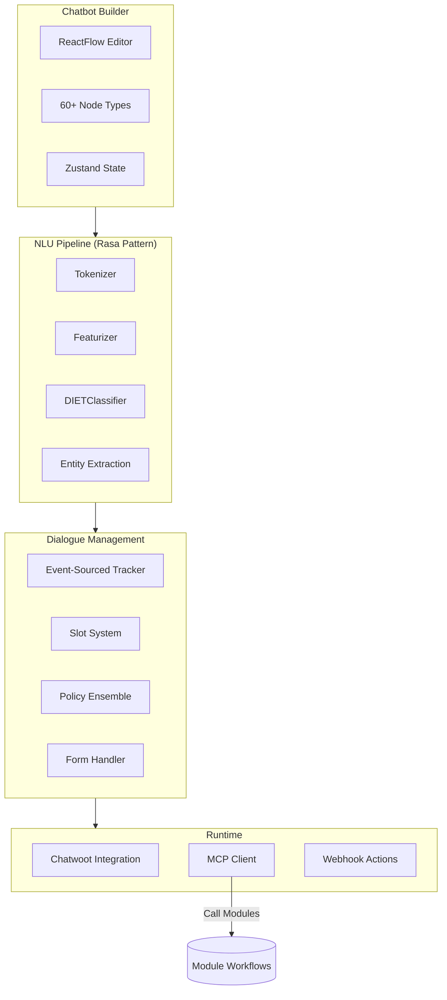

### 3.6 Voice Agent Architecture

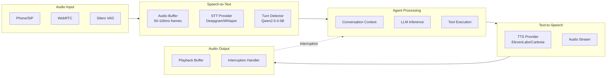

### 3.7 Canvas Builder Architecture

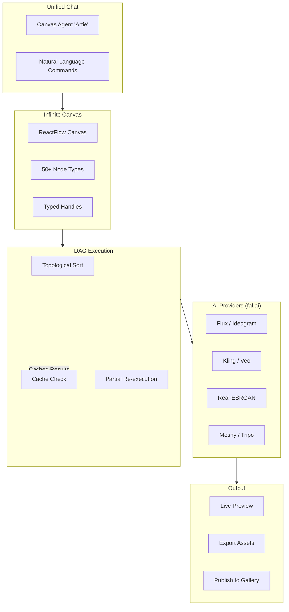

### 3.8 Integration Flow Architecture (Hybrid Approach)

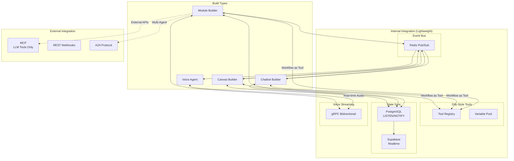

**Pattern Selection:**
| Scenario | Pattern | Why |
|----------|---------|-----|
| Module ↔ Chatbot | Dify-style Tool | Low overhead, shared context |
| Voice ↔ Module | gRPC Streams | Real-time bidirectional |
| Cross-builder events | Redis Pub/Sub | Fan-out, decoupled |
| State synchronization | PostgreSQL NOTIFY | Sub-millisecond, ACID |
| LLM function calling | MCP | Standard for LLM tools |
| External webhooks | REST | Universal compatibility |

### 3.9 Multi-Tenant UI Architecture

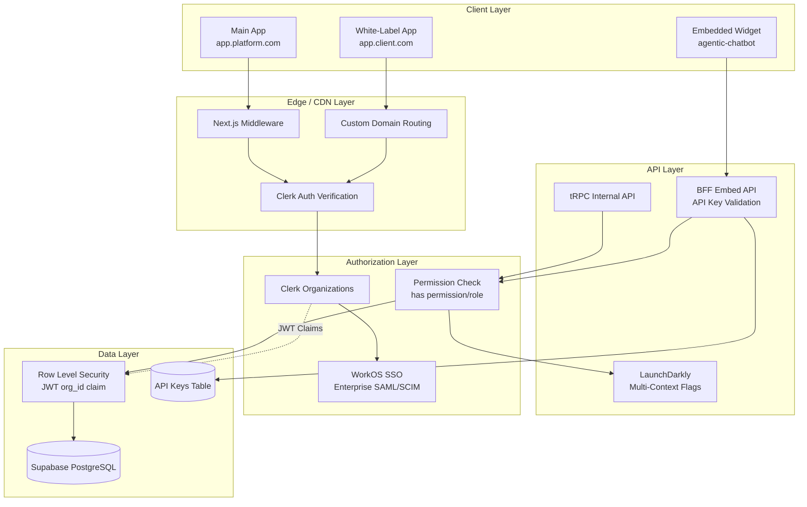

**Multi-Tenant Data Flow:**
| Layer | Component | Responsibility |
|-------|-----------|----------------|
| Edge | Next.js Middleware | Route protection, org context injection |
| Auth | Clerk Organizations | B2B RBAC, custom roles/permissions |
| Auth | WorkOS | Enterprise SSO (SAML), Directory Sync (SCIM) |
| API | BFF Pattern | API key validation, scoped access for embeds |
| Feature | LaunchDarkly | Per-org/project feature flags |
| Data | Supabase RLS | JWT-based tenant isolation (`auth.jwt() ->> 'org_id'`) |

### 3.10 Billing & Marketplace Architecture

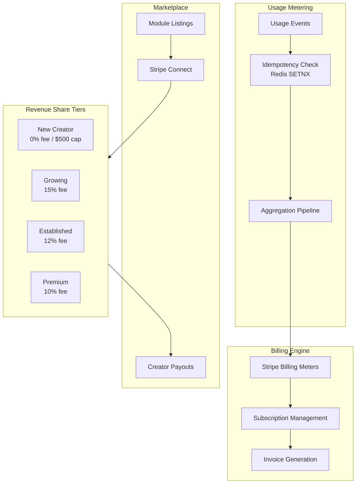

### 3.11 Security Architecture

```mermaid
flowchart TB
    subgraph Input["Input Security"]
        WAF[WAF / Rate Limiting]
        InputSanitize[Input Sanitization]
        PromptGuard[NeMo Guardrails]
    end

    subgraph Auth["Authentication"]
        Clerk[Clerk (Consumer)]
        WorkOS[WorkOS (Enterprise)]
        MFA[MFA / Passkeys]
    end

    subgraph Isolation["Tenant Isolation"]
        RLS[Row-Level Security]
        SchemaIso[Schema Isolation]
        DBIso[Database Isolation]
    end

    subgraph Execution["Code Execution"]
        Firecracker[Firecracker MicroVMs]
        gVisor[gVisor (runsc)]
        ResourceLimits[Resource Limits]
    end

    subgraph Data["Data Security"]
        Encryption[Encryption at Rest]
        TLS[TLS in Transit]
        Secrets[Infisical Secrets]
    end

    subgraph Audit["Audit & Compliance"]
        AuditLog[Immutable Audit Log]
        SOCP[SOC 2 Compliance]
        GDPR[GDPR / EU AI Act]
    end

    Input --> Auth
    Auth --> Isolation
    Isolation --> Execution
    Execution --> Data
    Data --> Audit
```

### 3.12 Observability Architecture

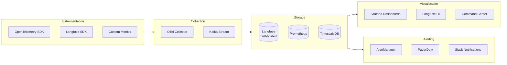

### 3.13 Deployment Architecture

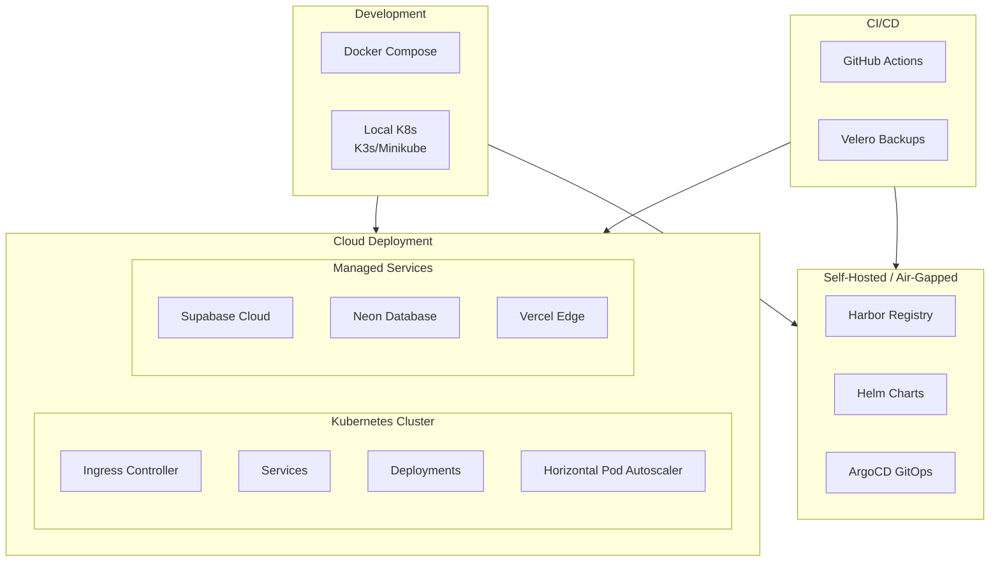

---

## 4. Unified Data Model

### 4.1 Core Entity Relationships

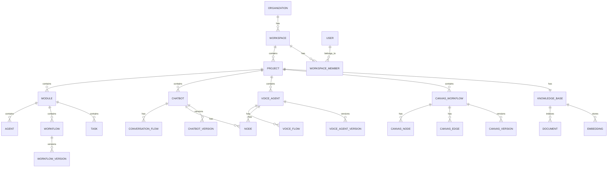

### 4.2 Key Data Models

```typescript
// Multi-tenant hierarchy
interface Organization {
  id: string;
  name: string;
  stripeCustomerId: string;
  subscriptionTier: 'free' | 'pro' | 'team' | 'enterprise';
  settings: OrganizationSettings;
}

interface Workspace {
  id: string;
  organizationId: string;
  name: string;
  slug: string;
  databaseStrategy: 'shared' | 'schema' | 'isolated';
  neonProjectId?: string; // For enterprise
}

interface Project {
  id: string;
  workspaceId: string;
  name: string;
  knowledgeBaseId: string;
  settings: ProjectSettings;
}

// Build artifacts
interface Module {
  id: string;
  projectId: string;
  name: string;
  type: 'agent' | 'workflow' | 'task';
  definition: ModuleDefinition;
  version: string;
  publishedToMarketplace: boolean;
}

interface Chatbot {
  id: string;
  projectId: string;
  name: string;
  flows: ConversationFlow[];
  chatwootInboxId?: string;
  version: string;
}

interface VoiceAgent {
  id: string;
  projectId: string;
  name: string;
  pipeline: VoicePipelineConfig;
  twilioPhoneNumber?: string;
  version: string;
}

interface CanvasWorkflow {
  id: string;
  projectId: string;
  name: string;
  nodes: Record<string, CanvasNode>;
  edges: Record<string, CanvasEdge>;
  viewport: Viewport;
  version: string;
}

// Execution models
interface WorkflowExecution {
  id: string;
  workflowId: string;
  status: 'pending' | 'running' | 'paused' | 'completed' | 'failed';
  input: Record<string, any>;
  output?: Record<string, any>;
  variablePool: VariablePool;
  trace: ExecutionTrace;
  cost: CostBreakdown;
  startedAt: Date;
  completedAt?: Date;
}

interface ConversationSession {
  id: string;
  chatbotId: string;
  chatwootConversationId?: string;
  slots: Record<string, SlotValue>;
  events: ConversationEvent[]; // Event-sourced
  context: ConversationContext;
  status: 'active' | 'resolved' | 'handoff';
}

// Marketplace models
interface MarketplaceItem {
  id: string;
  creatorId: string;
  type: 'module' | 'chatbot' | 'voice_agent' | 'canvas_workflow';
  title: string;
  description: string;
  pricing: PricingModel;
  stats: ItemStats;
  version: string;
}

interface CreatorAccount {
  id: string;
  userId: string;
  stripeConnectId: string;
  tier: 'new' | 'growing' | 'established' | 'premium';
  lifetimeGMV: number;
  payoutSchedule: 'weekly' | 'monthly';
}
```

---

## 5. Integration Patterns

### 5.1 Hybrid Integration Architecture (Recommended)

Based on research of Dify, n8n, and lightweight alternatives, the recommended approach minimizes MCP context overhead for internal integration while reserving MCP for external tool calling.

```mermaid
flowchart TB
    subgraph Voice["VOICE SUBSYSTEM"]
        VoiceIn[Audio Input]
        VoiceOut[Audio Output]
        gRPC[gRPC Bidirectional<br/>Stream]
    end

    subgraph EventBus["EVENT BUS (Redis Pub/Sub)"]
        Topics[Topics:<br/>module:* | chatbot:*<br/>voice:* | canvas:*]
    end

    subgraph Builders["BUILD TYPES"]
        subgraph ChatbotB["CHATBOT"]
            CB_REST[REST API]
            CB_Chatwoot[Chatwoot]
        end

        subgraph ModuleB["MODULE"]
            M_Tools[Workflows<br/>as Tools]
            M_VarPool[Variable<br/>Pool]
        end

        subgraph CanvasB["CANVAS"]
            CA_DAG[DAG Engine]
            CA_Providers[AI Providers]
        end
    end

    subgraph State["STATE LAYER"]
        PG[(PostgreSQL<br/>+ LISTEN/NOTIFY)]
        Supabase[Supabase<br/>Realtime]
    end

    VoiceIn --> gRPC
    gRPC --> VoiceOut
    gRPC <--> ModuleB

    ChatbotB <-->|Dify-style<br/>Tool Calls| ModuleB
    CanvasB <-->|Dify-style<br/>Tool Calls| ModuleB

    ChatbotB --> EventBus
    ModuleB --> EventBus
    CanvasB --> EventBus
    EventBus --> ChatbotB
    EventBus --> CanvasB

    ChatbotB <--> PG
    ModuleB <--> PG
    CanvasB <--> PG
    PG --> Supabase
```

### 5.2 Pattern Selection Matrix

| Scenario | Pattern | Latency | Context Overhead |
|----------|---------|---------|------------------|
| **Module → Chatbot** (tool call) | Dify-style "Workflow as Tool" | < 500ms | Low |
| **Chatbot → Module** (query) | PostgreSQL direct + NOTIFY | < 100ms | Minimal |
| **Voice ↔ Module** (streaming) | gRPC bidirectional | < 50ms | Low |
| **Canvas → Chatbot** (notification) | Redis Pub/Sub | < 200ms | Very Low |
| **Module → Canvas** (trigger) | Dify-style Tool | < 500ms | Low |
| **Any → Any** (state sync) | PostgreSQL LISTEN/NOTIFY | < 10ms | Minimal |
| **External → Any** (webhook) | REST Webhook | Async | Very Low |
| **LLM function calling** | MCP | Variable | Medium-High |

### 5.3 Dify-Style "Workflow as Tool" Pattern

For internal workflow-to-workflow calls (Module ↔ Chatbot ↔ Canvas), use Dify's pattern instead of MCP:

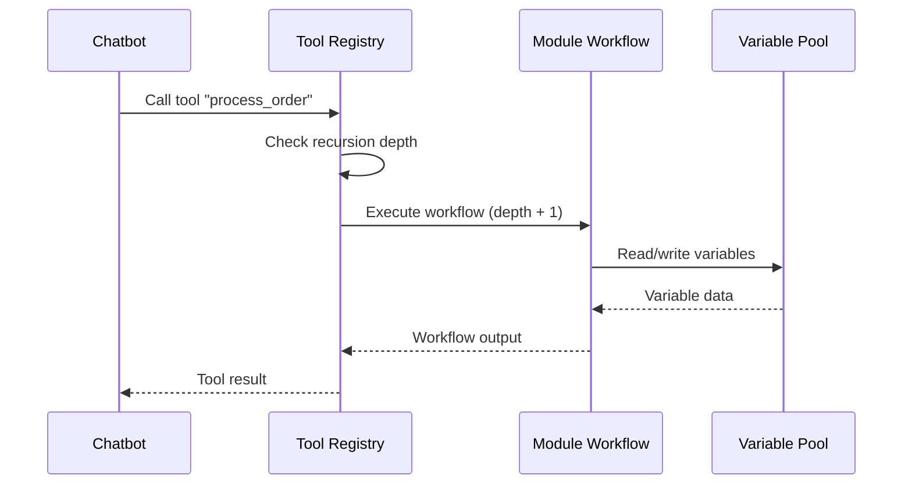

**Key Benefits:**
- No MCP server/client negotiation overhead
- Native variable pool sharing between workflows
- Built-in recursion protection (`workflow_call_depth`)
- Same visual canvas for all workflows

### 5.4 PostgreSQL LISTEN/NOTIFY (State Sync)

For real-time state synchronization across all builders:

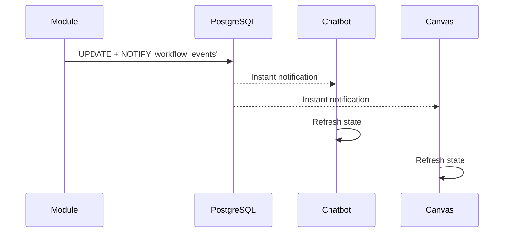

**Implementation with Supabase:**
```typescript
// All builders subscribe to state changes
const channel = supabase
  .channel('workflow-events')
  .on('postgres_changes',
    { event: '*', schema: 'public', table: 'workflows' },
    (payload) => handleStateChange(payload)
  )
  .subscribe();
```

### 5.5 gRPC Bidirectional Streams (Voice)

For real-time Voice ↔ Agent communication:

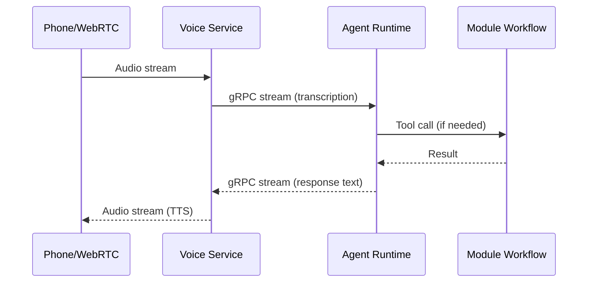

### 5.6 Redis Pub/Sub (Event Fan-out)

For cross-builder notifications and decoupled event distribution:

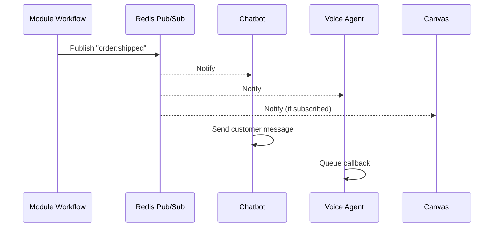

### 5.7 A2A Integration (Multi-Agent Orchestration)

Reserve A2A for complex multi-agent scenarios that span beyond the platform:

```mermaid
sequenceDiagram
    participant A1 as Research Agent
    participant Conductor as Conductor
    participant A2 as Writer Agent
    participant A3 as Review Agent

    Conductor->>A1: Task: Research topic
    A1-->>Conductor: Research results
    Conductor->>A2: Task: Write content
    A2-->>Conductor: Draft content
    Conductor->>A3: Task: Review content
    A3-->>Conductor: Feedback
    Conductor->>A2: Task: Revise
    A2-->>Conductor: Final content
```

### 5.8 MCP Integration (External Tools Only)

Reserve MCP for LLM function calling and external tool integrations:

```mermaid
sequenceDiagram
    participant LLM as Claude/GPT
    participant MCP as MCP Server
    participant Ext as External API

    LLM->>MCP: Call tool "search_web"
    MCP->>Ext: HTTP request
    Ext-->>MCP: Response
    MCP-->>LLM: Tool result
```

### 5.9 Context Overhead Comparison

| Pattern | Memory/Context | Setup | Best For |
|---------|----------------|-------|----------|
| **MCP** | Medium-High | Medium | LLM tools, external APIs |
| **Dify-style Tool** | Low | Low | Internal workflow calls |
| **PostgreSQL NOTIFY** | Minimal | None | State synchronization |
| **Redis Pub/Sub** | Very Low | Simple | Event fan-out |
| **gRPC Stream** | Low | Medium | Voice real-time |
| **REST Webhook** | Very Low | Trivial | External triggers |

---

## 6. Component Inventory (Deduplicated)

### 6.1 Services to Build

| Service | Description | Depends On | Priority |
|---------|-------------|------------|----------|
| **API Gateway** | Kong/Tyk with auth middleware | Auth Service | P0 |
| **Auth Service** | Clerk + WorkOS integration | - | P0 |
| **Module Service** | CRUD for modules, workflows | Database, Auth | P0 |
| **Chatbot Service** | Flow builder, NLU, dialogue | Module Service | P0 |
| **Voice Service** | Voice pipeline orchestration | Module Service | P1 |
| **Canvas Service** | DAG execution, AI providers | Module Service | P1 |
| **RAG Service** | Knowledge base, embeddings | Vector DB, Graph DB | P0 |
| **MCP Hub** | Tool registry, execution | Module Service | P0 |
| **Billing Service** | Metering, Stripe integration | Stripe | P0 |
| **Marketplace Service** | Listings, Connect payouts | Billing Service | P1 |
| **Observability Service** | Langfuse, tracing | - | P0 |
| **Notification Service** | Email, webhooks | Resend | P1 |
| **Collaboration Service** | Yjs sync, presence | Redis | P2 |

### 6.2 External Dependencies

| Dependency | Service | Purpose | Required |
|------------|---------|---------|----------|
| **Supabase** | Database | PostgreSQL + RLS + Realtime | Yes |
| **Neon** | Database | Enterprise isolation | Enterprise only |
| **Redis** | Cache | Caching, pub/sub, rate limiting | Yes |
| **Clerk** | Auth | Consumer authentication | Yes |
| **WorkOS** | Auth | Enterprise SSO/SCIM | Enterprise only |
| **Stripe** | Payments | Billing, Connect | Yes |
| **Chatwoot** | Support | Multi-channel messaging | Yes |
| **Twilio** | Telephony | Voice, SIP | Voice only |
| **fal.ai** | AI Gateway | 600+ AI models | Canvas only |
| **Langfuse** | Observability | Tracing, cost tracking | Yes |
| **Resend** | Email | Transactional email | Yes |

### 6.3 Shared Libraries

| Library | Purpose | Used By |
|---------|---------|---------|
| `@platform/ui` | shadcn/ui components | All frontends |
| `@platform/flow-editor` | ReactFlow wrapper | Module, Chatbot, Voice, Canvas |
| `@platform/auth` | Auth helpers, RLS | All services |
| `@platform/mcp` | MCP client/server | All services |
| `@platform/billing` | Metering, usage | All services |
| `@platform/collab` | Yjs integration | All builders |

---

## 7. Gap Analysis

### 7.1 Identified Gaps

| Area | Gap | Impact | Status | Resolution |
|------|-----|--------|--------|------------|
| **Client Access Management** | Per-project auth/authz | Clients can't access projects | ✅ RESOLVED | Clerk Organizations + custom permissions |
| **Multi-Tenant UI Isolation** | Data leakage risk | Security vulnerability | ✅ RESOLVED | Supabase RLS + JWT claims |
| **Per-Project Features** | Feature exposure control | Wrong features visible | ✅ RESOLVED | LaunchDarkly multi-context targeting |
| **Embedded UI Patterns** | Client integration | No embed strategy | ✅ RESOLVED | Web Components + React SDK + iframe |
| **API Key Management** | Client authentication | Insecure embeds | ✅ RESOLVED | Scoped API keys + BFF pattern |
| **White-Label Config** | Branding customization | No multi-brand support | ✅ RESOLVED | Metadata-driven theming + custom domains |
| **Search/Discovery** | No full-text search strategy | Users can't find modules | ✅ RESOLVED | Meilisearch hybrid search (see `architecture-gaps-research-2026-01-23.md`) |
| **Caching Strategy** | Fragmented across documents | Inconsistent performance | ✅ RESOLVED | Redis + memory tiered caching (see `architecture-gaps-research-2026-01-23.md`) |
| **Mobile Support** | No mobile-specific research | Limited reach | ✅ RESOLVED | Responsive-first + PWA meta tags (see `architecture-gaps-research-2026-01-23.md`) |
| **Offline Mode** | IndexedDB mentioned but not detailed | Poor offline UX | ✅ RESOLVED | Serwist/Workbox service worker (see `architecture-gaps-research-2026-01-23.md`) |
| **Testing Strategy** | No E2E testing strategy | Quality risk | ✅ RESOLVED | Playwright E2E + Vitest unit (see `architecture-gaps-research-2026-01-23.md`) |
| **CI/CD Details** | High-level only | Deployment friction | ✅ RESOLVED | GitHub Actions matrix builds (see `architecture-gaps-research-2026-01-23.md`) |
| **Monitoring Alerts** | Alert rules not defined | Incident response | ✅ RESOLVED | Prometheus alerting + runbooks (see `architecture-gaps-research-2026-01-23.md`) |
| **Rate Limiting** | Mentioned but not unified | Inconsistent limits | ✅ RESOLVED | Redis sliding window + tiered limits (see `architecture-gaps-research-2026-01-23.md`) |

### 7.2 Potential Redundancies

| Component | Documents | Resolution |
|-----------|-----------|------------|
| **State Management** | Zustand recommended in Tier 1, 6, 7 | ✅ Consistent - use Zustand everywhere (Competitors vary: Dify=Zustand, n8n=Pinia, Flowise=Redux; chosen for React, validated by Dify) |
| **Real-time Sync** | SSE in Tier 0, WebSocket in Tier 4 | ✅ Both needed - SSE for serverless, WS for collab |
| **Event Sourcing** | Tier 4, Tier 6 | ✅ Consistent pattern |
| **MCP Protocol** | Tier 0, Tier 6 | ✅ Same protocol, different contexts |
| **Cost Tracking** | Tier 3, Tier 4, Tier 8 | ✅ Unified Cost Service designed (see `unified-cost-service-architecture-2026-01-23.md`) |

### 7.3 Architecture Conflicts

| Conflict | Description | Resolution | Status |
|----------|-------------|------------|--------|
| **Database Strategy** | Shared vs Isolated confusion | Tiered: Free/Pro/Team = shared (Supabase + RLS), Enterprise = isolated (Neon) | ✅ VALIDATED (see `architecture-conflicts-validation-2026-01-23.md`) |
| **Auth Provider** | Clerk vs Auth0 mentioned | Standardize on Clerk + WorkOS (Clerk for B2B, WorkOS for enterprise SSO/SCIM) | ✅ VALIDATED (see `architecture-conflicts-validation-2026-01-23.md`) |
| **Queue System** | Redis Streams vs Kafka vs NATS | BullMQ + Redis for MVP, migrate to NATS JetStream for scale | ✅ VALIDATED (see `architecture-conflicts-validation-2026-01-23.md`) |

---

## 8. Implementation Phases

### Phase 1: Foundation (MVP)
- API Gateway + Auth
- Module Builder (basic)
- RAG Service
- MCP Hub
- Billing (basic)

### Phase 2: Customer-Facing
- Chatbot Builder
- Chatwoot Integration
- Embedded Chat UI
- Marketplace (basic)

### Phase 3: Advanced Builders
- Voice Agent Builder
- Canvas Builder (basic)
- AI Provider Integration

### Phase 4: Enterprise
- Enterprise Auth (WorkOS)
- Database Isolation (Neon)
- White Label
- Self-Hosted Deployment

### Phase 5: Scale
- Collaborative Editing
- Advanced Marketplace
- A/B Testing
- Advanced Observability

---

## 9. Validation Checklist

- [x] All 30 research documents processed
- [x] Technology stack unified and deduplicated
- [x] Data models defined
- [x] Integration patterns documented
- [x] Mermaid diagrams created for all major components
- [x] Gaps identified
- [x] Redundancies resolved
- [x] Conflicts addressed
- [ ] Peer review completed
- [ ] Stakeholder sign-off

---

## 10. References

All architecture decisions trace back to the following research documents:

**Tier 0 (Foundation):**
- `technical-agentic-rag-sdk-research-v2-2026-01-19.md`
- `technical-agentic-protocols-research-2026-01-19.md`

**Tier 1 (Platform Foundation):**
- `technical-claude-agent-sdk-research-2026-01-20.md`
- `technical-visual-workflow-builders-research-2026-01-20.md`
- `technical-multi-tenant-saas-research-2026-01-20.md`

**Tier 2 (Integration):**
- `technical-conversational-builder-research-2026-01-20.md`
- `technical-framework-abstraction-research-2026-01-20.md`
- `business-marketplace-economics-research-2026-01-20.md`

**Tier 3 (Polish):**
- `technical-billing-metering-research-2026-01-20.md`
- `technical-ui-generation-research-2026-01-20.md`

**Tier 4 (Advanced Features):**
- `technical-chatwoot-integration-research-2026-01-20.md`
- `technical-embedded-chat-ui-research-2026-01-21.md`
- `technical-command-center-research-2026-01-20.md`
- `technical-agent-observability-research-2026-01-20.md`
- `business-competitive-analysis-research-2026-01-20.md`
- `technical-agent-versioning-research-2026-01-21.md`
- `technical-security-sandboxing-research-2026-01-21.md`
- `technical-collaborative-editing-research-2026-01-21.md`
- `technical-mcp-skills-marketplace-research-2026-01-21.md`

**Tier 5 (Scale & Enterprise):**
- `technical-self-hosted-deployment-research-2026-01-21.md`
- `technical-white-label-research-2026-01-21.md`
- `technical-sso-enterprise-auth-research-2026-01-21.md`
- `business-pricing-strategy-research-2026-01-21.md`

**Tier 6 (Voice & Chatbot):**
- `technical-voice-stack-research-2026-01-22.md`
- `technical-chatbot-builder-research-2026-01-22.md`
- `technical-integration-layer-research-2026-01-22.md`
- `technical-livekit-architecture-study-2026-01-22.md`
- `technical-rasa-architecture-study-2026-01-22.md`

**Tier 7 (Canvas Builder):**
- `technical-canvas-builder-research-2026-01-22.md`

**Tier 8 (AI Providers):**
- `technical-ai-generation-providers-research-2026-01-22.md`
- `technical-ui-gaps-research-2026-01-23.md` (Multi-tenant UI architecture)

**Architecture Gaps Research:**

- `architecture-gaps-research-2026-01-23.md` (Search, Caching, Mobile, Offline, Testing, CI/CD, Monitoring, Rate Limiting)

**Redundancy Validation:**

- `redundancy-validation-report-2026-01-23.md` (State Management, Real-time Sync, Event Sourcing, MCP Protocol, Cost Tracking)
- `unified-cost-service-architecture-2026-01-23.md` (Unified cost tracking design)

**Architecture Conflicts Validation:**

- `architecture-conflicts-validation-2026-01-23.md` (Database Strategy, Auth Provider, Queue System)

**Supplementary Validation Reports (in /research):**

- `technical-security-sandboxing-research-VALIDATION-REPORT-2026-01-21.md`
- `technical-self-hosted-deployment-research-VALIDATION-REPORT-2026-01-21.md`
- `technical-sso-enterprise-auth-research-VALIDATION-REPORT-2026-01-21.md`

**Comprehensive Validation:**

- `comprehensive-validation-report-2026-01-23.md` (Cross-validation of all documents)

---

*Document generated: 2026-01-23*
*Last updated: 2026-01-23 (v1.5 - Comprehensive Validation Complete)*
